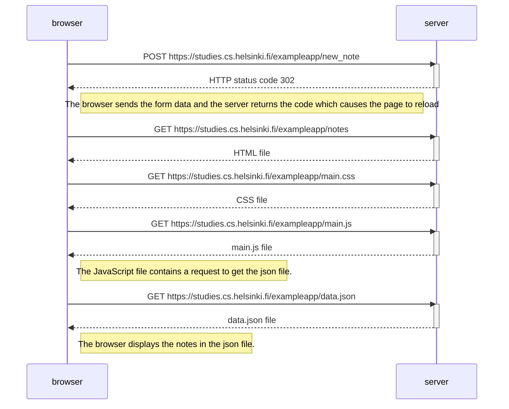

```mermaid
sequenceDiagram
    participant browser
    participant server


    browser->>server: POST https://studies.cs.helsinki.fi/exampleapp/new_note
    activate server
    server-->>browser:  HTTP status code 302
    deactivate server
Note right of browser: The browser sends the form data and the server returns the code which causes the page to reload

    browser->>server: GET https://studies.cs.helsinki.fi/exampleapp/notes
    activate server
    server-->>browser: HTML file
    deactivate server

    browser->>server: GET https://studies.cs.helsinki.fi/exampleapp/main.css
    activate server
    server-->>browser: CSS file
    deactivate server

    browser->>server: GET https://studies.cs.helsinki.fi/exampleapp/main.js
    activate server
    server-->>browser: main.js file
    deactivate server
Note right of browser: The JavaScript file contains a request to get the json file.

browser->>server: GET https://studies.cs.helsinki.fi/exampleapp/data.json
    activate server
    server-->>browser: data.json file
    deactivate server
    Note right of browser: The browser displays the notes in the json file.

```
